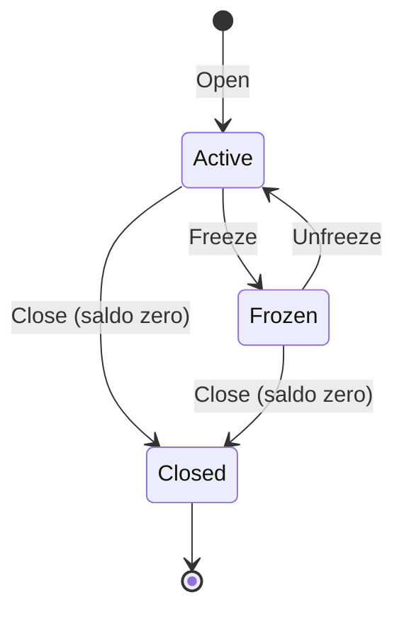
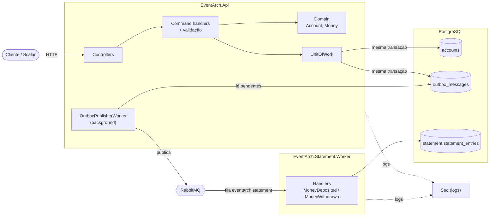
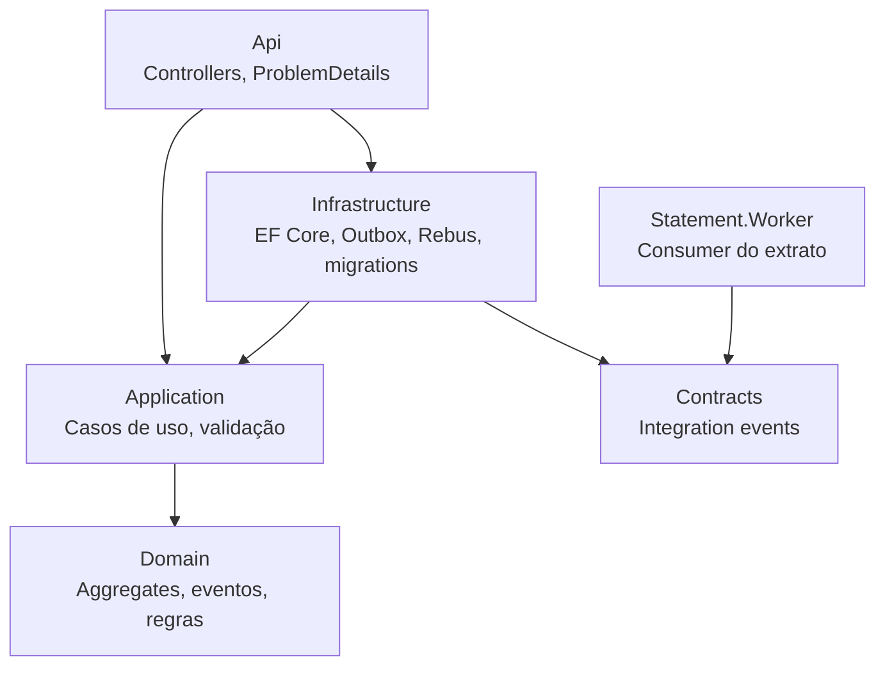
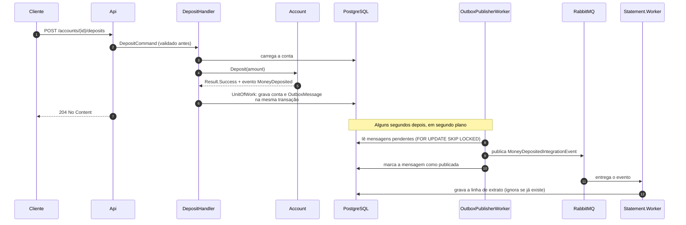

# event-arch

[](https://github.com/Kawhan/event-arch/actions/workflows/ci.yml)

API de contas bancárias em DDD, orientada a eventos, em C# / .NET 10.

Cada operação de negócio gera um **evento de domínio**. O evento é gravado em
um **Outbox** na mesma transação da operação e publicado no **RabbitMQ**, de
onde serviços independentes (como o de extrato) consomem.

## Stack

.NET 10 · ASP.NET Core (Controllers) · EF Core + PostgreSQL · Rebus + RabbitMQ ·
Outbox · FluentValidation · Serilog + Seq · Scalar · xUnit · Docker Compose

---

## Funcionalidades

### Contas

| Operação | Rota | Sucesso | Evento gerado |
|---|---|---|---|
| Abrir conta | `POST /accounts` | `201` + `accountId` | `AccountOpened` |
| Consultar conta | `GET /accounts/{accountId}` | `200` + dados da conta | — |
| Depositar | `POST /accounts/{accountId}/deposits` | `204` | `MoneyDeposited` |
| Sacar | `POST /accounts/{accountId}/withdrawals` | `204` | `MoneyWithdrawn` |
| Bloquear | `POST /accounts/{accountId}/freeze` | `204` | `AccountFrozen` |
| Desbloquear | `POST /accounts/{accountId}/unfreeze` | `204` | `AccountUnfrozen` |
| Encerrar | `POST /accounts/{accountId}/close` | `204` | `AccountClosed` |

### Transferências

| Operação | Rota | Sucesso | Eventos gerados |
|---|---|---|---|
| Transferir entre contas | `POST /transfers` | `200` + `transferId` | `MoneyWithdrawn` (origem), `MoneyDeposited` (destino), `MoneyTransferred` |

Os três eventos de uma transferência carregam o mesmo `transferId`. Débito e
crédito são gravados na **mesma transação**: ou as duas contas mudam, ou
nenhuma muda.

### Extrato (serviço `Statement.Worker`)

O Worker consome `MoneyDeposited` e `MoneyWithdrawn` e grava uma linha de
extrato (crédito ou débito, valor e saldo após a operação) no schema
`statement` do Postgres. Ainda não há rota HTTP para consultar o extrato.

### Regras de negócio

- O valor de uma operação é em **BRL**, maior que zero e com no máximo **duas
  casas decimais**.
- O saldo **nunca fica negativo**: saque ou transferência acima do saldo é
  recusado.
- Conta **bloqueada** não movimenta dinheiro. Ela pode ser desbloqueada ou
  encerrada.
- Conta só pode ser **encerrada com saldo zero**. Encerramento é definitivo.
- Não é possível transferir para a **mesma conta**.



### Respostas de erro

Todos os erros seguem o padrão **ProblemDetails** (RFC 7807) e trazem um
`code` estável para o cliente tratar sem depender da mensagem.

| Status | Quando | Exemplo de `code` |
|---|---|---|
| `400` | Entrada inválida (erros agrupados por campo) | — |
| `404` | Conta não encontrada | `Account.NotFound` |
| `409` | Regra de negócio violada | `Account.InsufficientFunds`, `Account.Frozen`, `Account.BalanceNotZero` |
| `409` | Duas requisições alteraram a mesma conta ao mesmo tempo | `Concurrency.Conflict` |
| `400` | Rota de dinheiro sem o cabeçalho `Idempotency-Key` | `Idempotency.KeyRequired` |
| `409` | Duas requisições com a mesma chave ao mesmo tempo | `Idempotency.ConcurrentRequest` |
| `422` | Chave já usada para uma requisição diferente | `Idempotency.KeyReused` |

### Idempotência

Depósito, saque e transferência exigem o cabeçalho **`Idempotency-Key`**,
um valor único por operação (por exemplo, um GUID novo). Isso torna seguro
repetir a requisição depois de um timeout:

- **Mesma chave e mesmo corpo:** devolve a resposta original, com o cabeçalho
  `Idempotency-Replayed: true`, sem movimentar dinheiro de novo. Vale também
  para erros de negócio: um saque recusado por falta de saldo continua
  recusado na repetição.
- **Mesma chave e corpo diferente:** `422`, e nada é executado.
- **Atomicidade:** a chave e a resposta são gravadas na tabela
  `idempotency_keys` **na mesma transação** da operação. Se duas requisições
  com a mesma chave chegarem juntas, só uma faz commit; a outra é desfeita por
  inteiro.
- Erros `5xx` não são gravados, então a repetição executa de novo.

---

## Arquitetura

### Visão geral dos serviços



### Camadas (Clean Architecture)

As dependências apontam sempre para o `Domain`. O Worker é um serviço
independente: só conhece os `Contracts` (os eventos públicos), nunca o domínio.



| Projeto | Responsabilidade |
|---|---|
| `Domain` | `Account`, `Money`, regras de negócio, eventos de domínio, `Result`/`Error`. Sem dependências externas |
| `Application` | Um caso de uso por pasta (comando, handler e validator). Interfaces de repositório e de unidade de trabalho |
| `Infrastructure` | Persistência com EF Core, Outbox, publicação via Rebus e migrations |
| `Contracts` | Integration events: o contrato público compartilhado com os consumers |
| `Api` | Traduz HTTP em comandos e `Result` em respostas HTTP |
| `Statement.Worker` | Consome eventos e monta o extrato. Banco próprio (schema `statement`) |

### Como uma operação percorre o sistema

Exemplo de um depósito, da requisição até a linha de extrato:



### Garantias de entrega

- **Nenhum evento se perde.** O evento é gravado no Outbox na mesma transação
  da operação. Se a transação falhar, nem a operação nem o evento existem.
- **Entrega "pelo menos uma vez".** Se a publicação der certo e a marcação
  como publicada falhar, a mensagem é publicada de novo. Por isso o consumer é
  **idempotente**: o `EventId` é a chave primária da linha de extrato, e um
  evento repetido é ignorado.
- **Mensagens que nunca publicam.** Cada falha de publicação incrementa
  `outbox_messages.attempts`. Ao atingir `Outbox:MaxAttempts` (padrão 10), a
  mensagem recebe `dead_lettered_on_utc`, sai da fila do publicador e gera um
  log de **Error**. Assim, mensagens quebradas não bloqueiam as que vêm atrás.
  Para investigar:
  `SELECT id, type, attempts, error FROM outbox_messages WHERE dead_lettered_on_utc IS NOT NULL;`
  Depois de corrigir a causa, limpar `dead_lettered_on_utc` e `attempts` faz a
  mensagem ser tentada de novo.
- **Falhas no consumer.** O Rebus tenta processar a mensagem 5 vezes e depois
  a move para a fila `error`, para análise.
- **Concorrência.** A coluna de sistema `xmin` do Postgres funciona como versão
  da conta. Se duas requisições alterarem a mesma conta ao mesmo tempo, a
  segunda recebe `409`.

### Rastreando uma operação

O `TraceId` da requisição HTTP é gravado na mensagem do Outbox e enviado como
`CorrelationId` no header da mensagem. No Seq, a busca abaixo mostra a
requisição na API e o processamento no Worker juntos:

```
TraceId = '<id>' or CorrelationId = '<id>'
```

---

## Como rodar

Painéis locais:

| Ferramenta | Endereço | Uso |
|---|---|---|
| Scalar | http://localhost:5190/scalar | Testar a API (só em Development) |
| Seq | http://localhost:5341 | Logs da API e do Worker |
| RabbitMQ | http://localhost:15672 (guest/guest) | Filas e mensagens |

Em Development, a API e o Worker aplicam as migrations ao subir.

**Tudo no Docker** (API em http://localhost:5190):

```bash
docker compose up -d --build
docker compose down        # parar (adicione -v para apagar os dados)
```

**Infra no Docker, aplicação na IDE** (para depurar com breakpoints):

```bash
docker compose up -d postgres rabbitmq seq
dotnet tool restore                                   # dotnet-ef (local)
dotnet run --project src/EventArch.Api                # API
dotnet run --project src/EventArch.Statement.Worker   # consumer
```

Não rode os dois modos ao mesmo tempo: a porta 5190 entra em conflito e dois
Workers dividiriam as mensagens da mesma fila.

**Testes:**

```bash
dotnet test
```

- `EventArch.Domain.Tests`: regras de negócio, sem infraestrutura.
- `EventArch.IntegrationTests`: precisa do Docker rodando. O Testcontainers
  cria um Postgres e um RabbitMQ descartáveis, sobe a API em memória e apaga
  tudo no final. Não usa nem altera os containers do compose. Cobre o HTTP de
  ponta a ponta, o Outbox, a publicação no RabbitMQ e a concorrência.
- **CI:** o GitHub Actions ([ci.yml](.github/workflows/ci.yml)) compila com
  avisos tratados como erro e roda todos os testes a cada push na `main` e em
  todo pull request.

**Ver uma mensagem parada no RabbitMQ:** pare o consumer com
`docker compose stop statement-worker`, faça um depósito e abra a fila
`eventarch.statement` → *Get messages*. Depois,
`docker compose start statement-worker` processa o que ficou esperando.

---

## Limitações conhecidas e evoluções

- **Chaves de idempotência não expiram.** A tabela `idempotency_keys` cresce
  para sempre; falta um job que apague chaves antigas (por exemplo, com mais de
  24 horas).

- **O saldo é um valor mutável.** A coluna `accounts.balance` é atualizada a
  cada operação, e os eventos são só um efeito colateral para avisar outros
  serviços. Sistemas financeiros reais costumam fazer o contrário: um histórico
  imutável de operações é a fonte da verdade e o saldo é uma projeção dele.
  Caminhos possíveis: **Event Sourcing** (por exemplo, com Marten sobre o
  Postgres) e/ou um **livro razão de partidas dobradas**.
- **Transferência síncrona.** Débito e crédito acontecem numa única transação
  de banco. Evolução possível: saga com consistência eventual (o Rebus suporta
  sagas).
- **Extrato sem rota de consulta.** O Worker só grava; falta algo como
  `GET /accounts/{id}/statement`.
- **Ordem das mensagens não garantida.** Se uma mensagem falha ao publicar, as
  seguintes do lote seguem. O extrato não depende da ordem, porque cada evento
  traz o saldo após a operação.

## Status

Domain, Application, Infrastructure, Api e Statement.Worker implementados.
Testes: 33 unitários (Domain) e 11 de integração (Testcontainers).
